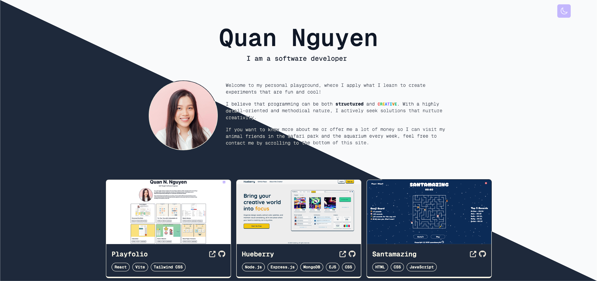

# Playfolio (Personal Portfolio)

## Overview

A modern, responsive personal portfolio website built with React and Tailwind CSS. This project showcases my journey as a developer, featuring my projects, skills, and professional timeline.

## Live Demo

[View the live site](https://quannguyendev.com/)

## Screenshots

## Features

* Responsive design that works on all devices
* Dark/light mode toggle
* Dynamic type animation for introducing myself
* Project portfolio with links to live demos and GitHub repositories
* Interactive timeline of my professional journey
* Contact form for potential employers or collaborators

## Technologies Used

**Frontend**

- **React**: A JavaScript library for building user interfaces
- **Tailwind CSS**: A utility-first CSS framework for rapid UI development

**Animation**

- **TypeAnimation**: For creating dynamic typewriter effects

**Form Handling**

- **Getform.io**: For processing and managing contact form submissions